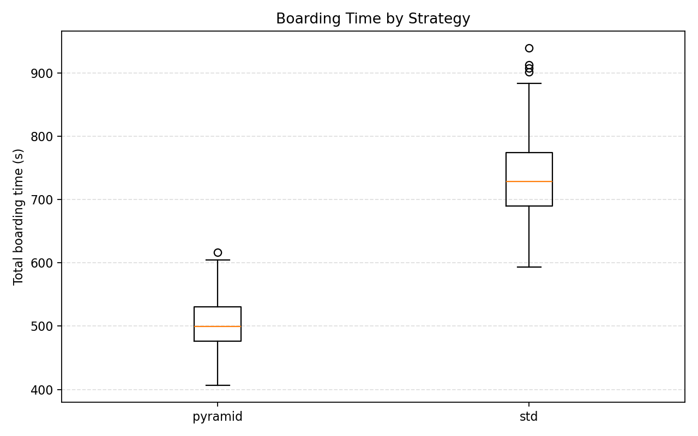
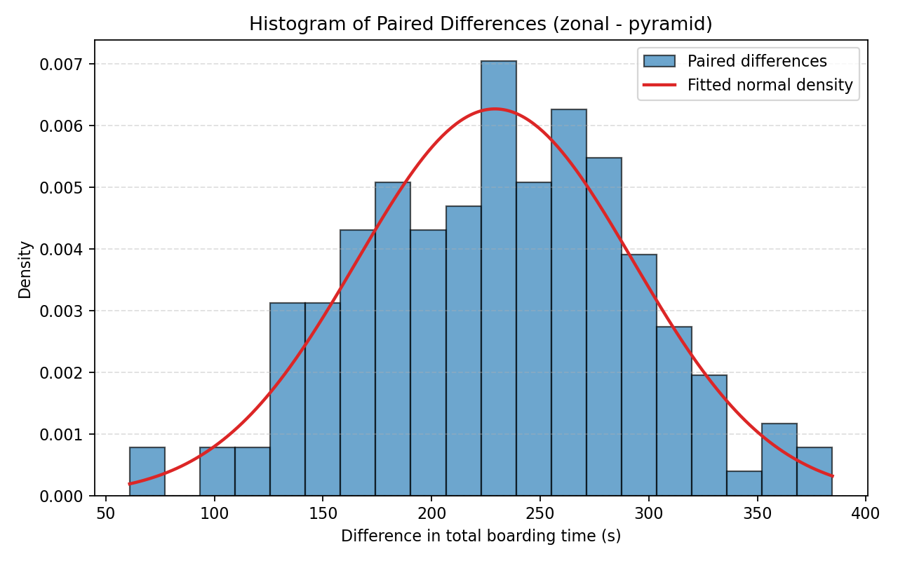
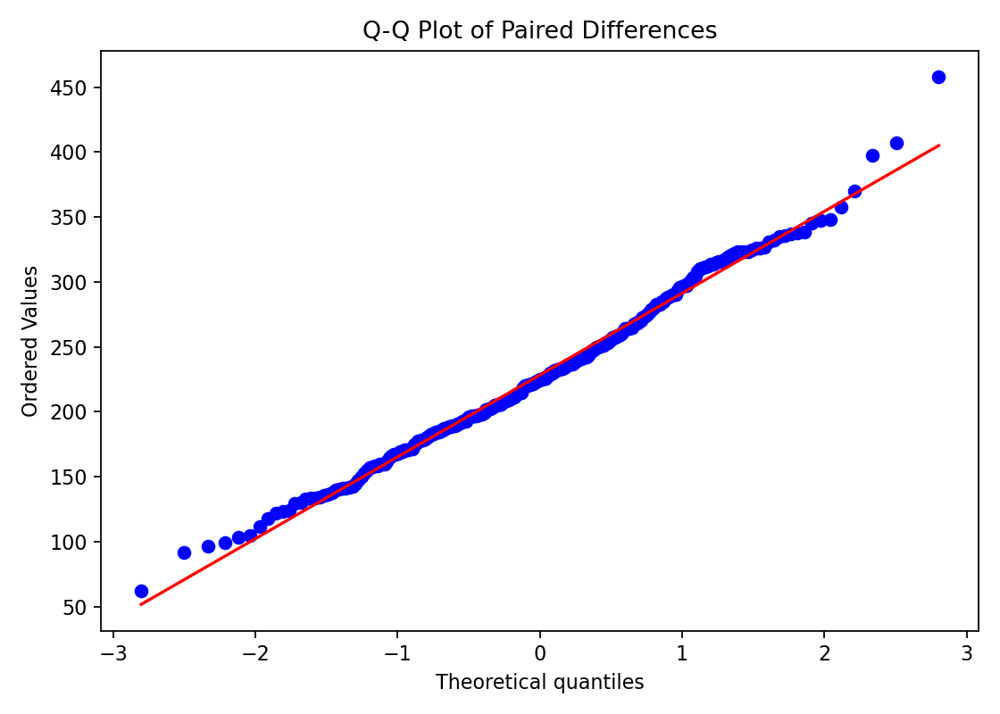

# Paired Boarding Strategy Report

Generated: 2026-04-15 12:18 UTC

## Study Design
- Independent variable: boarding strategy
- Primary dependent variable: total boarding time
- Strategies: back-to-front zonal vs modified reverse pyramid
- Fixed assumptions: aircraft layout and cabin topology, seat map and class structure, load factor, luggage probability, active boarding doors, behavioral parameter settings, simulation logic and completion condition

## Run Summary
| replications | master_seed | load_factor | luggage_probability | cross_zone_violation_rate | paired_runs | completed_pairs | failed_runs |
| --- | --- | --- | --- | --- | --- | --- | --- |
| 158 | 2.026e+07 | 0.85 | 0.75 | 0.05 | 158 | 158 | 0 |

## Descriptive Statistics
| strategy | n_completed | mean | std | median | min | q10 | q25 | q75 | q90 | max |
| --- | --- | --- | --- | --- | --- | --- | --- | --- | --- | --- |
| pyramid | 158 | 509.294 | 41.653 | 507.75 | 420.5 | 452.4 | 479 | 535.5 | 566.1 | 626 |
| std | 158 | 738.475 | 60.879 | 735.75 | 582.5 | 662.85 | 695.625 | 774.75 | 817.75 | 933 |

## Paired Inference
| n_pairs | mean_paired_difference | mean_relative_improvement | normality_p_value | selected_test | test_statistic | p_value | effect_size_vargha_delaney_A | effect_size_paired_d | ci95_low | ci95_high |
| --- | --- | --- | --- | --- | --- | --- | --- | --- | --- | --- |
| 158 | 229.18 | 0.307 |  | one-sided paired t-test (zonal - pyramid > 0) | 45.291 | 2.447e-92 | 1 | 3.603 | 219.185 | 239.175 |

## Paired Metrics
| replication_id | boarding_time_zonal | boarding_time_pyramid | difference | ratio | relative_improvement |
| --- | --- | --- | --- | --- | --- |
| 1 | 768 | 486 | 282 | 0.633 | 0.367 |
| 2 | 843.5 | 545.5 | 298 | 0.647 | 0.353 |
| 3 | 791.5 | 544.5 | 247 | 0.688 | 0.312 |
| 4 | 844 | 509.5 | 334.5 | 0.604 | 0.396 |
| 5 | 735 | 548 | 187 | 0.746 | 0.254 |
| 6 | 696 | 565.5 | 130.5 | 0.812 | 0.188 |
| 7 | 717.5 | 467.5 | 250 | 0.652 | 0.348 |
| 8 | 858.5 | 503.5 | 355 | 0.586 | 0.414 |
| 9 | 651 | 496.5 | 154.5 | 0.763 | 0.237 |
| 10 | 770.5 | 626 | 144.5 | 0.812 | 0.188 |
| 11 | 795.5 | 535.5 | 260 | 0.673 | 0.327 |
| 12 | 726.5 | 545 | 181.5 | 0.75 | 0.25 |

## Figures

### Boarding time by strategy
- What it shows: distribution of total boarding times per strategy (median, spread, and outliers).
- How to read it: lower boxes/medians mean faster boarding; narrower spread means more consistency.
- Conclusion: compare central tendency and spread to assess speed and reliability tradeoffs.

### Histogram of paired differences with fitted normal density
- What it shows: frequency distribution of paired differences (zonal - pyramid) with a fitted normal curve overlay.
- How to read it: values above 0 indicate pyramid is faster; the red curve is a visual normal-reference guide.
- Conclusion: center and spread indicate average gain and variability; compare bars vs curve for rough normality fit.

### Q-Q plot of paired differences
- What it shows: observed quantiles of paired differences against theoretical normal quantiles.
- How to read it: points close to a straight line suggest approximate normality; systematic bends indicate departures.
- Conclusion: supports whether the paired t-test normality assumption is reasonable.

## Notes
- Selected test: one-sided paired t-test (zonal - pyramid > 0), p-value: 2.447e-92, mean paired difference: 229.18 s.
- Best mean boarding time: pyramid at 509.294 s.
- Completed pairs: 158.
- Failed runs: 0.
